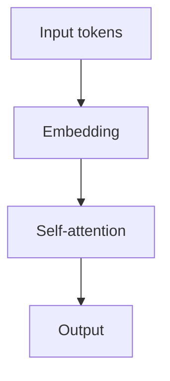

# 10drbob | Deep Learning & NLP Notes

这是 10drbob 的个人 AI 技术作品集网站，用来整理 Deep Learning、NLP、LLM、RAG 学习笔记，展示实践项目计划，并逐步接入经过复核的 Hugging Face Spaces Demo。

站点地址：

```text
https://10drbob.github.io/
```

后续由 Codex 或其他自动化助手维护本仓库时，请先阅读 [CODEX_INSTRUCTIONS.md](./CODEX_INSTRUCTIONS.md)。

## 1. 项目介绍

这个仓库是一个静态网站项目，核心目标是：

- 作为 Deep Learning / NLP / LLM 学习笔记入口。
- 作为个人 AI 项目作品集。
- 保存项目文档、公开发布边界和后续 Demo 接入说明。
- 通过 GitHub Pages 自动部署，不依赖后端和数据库。

当前页面内容以“笔记结构”和“项目计划”为主。未完成项目不能写成已完成，未复核实验结果不能写具体 benchmark 数字，没有真实 Demo 时不要显示已上线 Demo。

## 2. 技术栈

- Docusaurus 3
- React + TypeScript
- Markdown / MDX
- KaTeX math rendering
- Prism code highlighting
- Mermaid diagrams
- Hugging Face Spaces iframe embed
- Gradio Demo template
- GitHub Pages
- GitHub Actions

## 3. 网站结构

```text
docs/
├─ intro.mdx
├─ examples/
│  └─ technical-writing-demo.md
├─ deep-learning/
├─ nlp/
├─ paper-reading/
└─ projects/

src/
├─ components/
│  ├─ ProjectCard.tsx
│  └─ SpaceEmbed.tsx
└─ pages/
   ├─ index.tsx
   ├─ projects.tsx
   └─ about.tsx

examples/
└─ hf-spaces/
   └─ bert-sentiment-demo/
```

关键文件：

- `docusaurus.config.ts`：Docusaurus 主配置。
- `sidebars.ts`：docs 侧边栏。
- `src/pages/index.tsx`：首页。
- `src/pages/projects.tsx`：Projects 页面。
- `src/components/ProjectCard.tsx`：项目卡片组件。
- `src/components/SpaceEmbed.tsx`：Hugging Face Spaces 嵌入组件。
- `examples/hf-spaces/bert-sentiment-demo/`：Gradio Demo 模板。

不要提交 `node_modules/`、`build/`、`.docusaurus/`。

## 4. 本地开发命令

安装依赖：

```bash
npm install
```

启动本地预览：

```bash
npm run start
```

构建静态网站：

```bash
npm run build
```

执行 TypeScript 检查：

```bash
npm run typecheck
```

构建结果输出到 `build/`，该目录只作为本地或 CI 构建产物，不需要提交。

## 5. 新增一篇笔记的方法

1. 在对应目录下新增 Markdown 或 MDX 文件：
   - Deep Learning：`docs/deep-learning/`
   - NLP：`docs/nlp/`
   - Paper Reading：`docs/paper-reading/`
   - Examples：`docs/examples/`
2. 使用当前课程笔记模板结构：
   - 核心问题
   - 关键概念
   - 数学公式
   - 直观理解
   - PyTorch / Python 示例
   - 常见误区
   - 和其他概念的联系
   - 我的总结
   - 参考资料
3. 在 `sidebars.ts` 中加入新页面 id。
4. 如果要使用 React 组件，文件扩展名使用 `.mdx`。
5. 内容未完成时使用 `TODO`，不要大段编造课程内容。

新增后至少运行：

```bash
npm run build
npm run typecheck
```

## 6. 新增一个项目展示的方法

项目展示分两层维护：

- `src/pages/projects.tsx`：作品集页面上的项目卡片。
- `docs/projects/`：项目详细文档。

新增项目时：

1. 在 `docs/projects/` 新建项目文档。
2. 使用项目文档模板：
   - 项目简介
   - 问题定义
   - 数据集 / 输入输出
   - 方法概览
   - 模型或算法结构
   - 训练 / 实验流程
   - 实验结果
   - 错误分析
   - 改进方向
   - GitHub Repo
   - 在线 Demo
   - 我学到了什么
   - 公开边界说明
3. 在 `sidebars.ts` 的 `Projects` 分组中加入文档 id。
4. 在 `src/pages/projects.tsx` 增加 `ProjectCard` 数据。
5. 如果没有真实 GitHub 仓库、真实 Demo 或复核结果，使用 TODO 或占位说明，不要伪装成已完成。

项目状态建议使用：

- `Planned`
- `In Progress`
- `Archived`
- `Reviewed`

只有完成并复核后，才使用更强的完成状态。

## 7. 数学公式、代码块、Mermaid 写法

行内公式：

```md
Self-attention 的缩放因子是 $\sqrt{d_k}$。
```

块级公式：

```md
$$
\operatorname{Attention}(Q, K, V) =
\operatorname{softmax}\left(\frac{QK^\top}{\sqrt{d_k}}\right)V
$$
```

Python / PyTorch 代码块：

````md
```python
import torch

x = torch.randn(2, 4)
print(x.shape)
```
````

带标题的代码块：

````md
```python title="attention.py"
def attention(query, key, value):
    return query @ key.transpose(-2, -1)
```
````

Mermaid 图：

````md

````

完整测试页见 `docs/examples/technical-writing-demo.md`。

## 8. GitHub Pages 部署方法

当前站点部署到：

```text
https://10drbob.github.io/
```

当前仓库使用 GitHub 用户主页形式，因此 `docusaurus.config.ts` 中：

```ts
baseUrl: '/'
projectName: '10drbob.github.io'
```

除非任务明确要求修改部署目标，否则不要修改 GitHub Pages / GitHub Actions 部署配置。

## 9. GitHub Actions 说明

本项目通过 GitHub Actions 构建并部署：

1. checkout 仓库。
2. 设置 Node.js 环境。
3. 使用 `npm ci` 安装依赖。
4. 运行 `npm run build` 生成静态站点。
5. 上传 `build/` 作为 GitHub Pages artifact。
6. 使用 GitHub 官方 Pages 部署动作发布。

日常维护只需要 push 到主分支，部署状态可在仓库的 `Actions` 页面查看。

## 10. Hugging Face Spaces Demo 说明

主站提供 `SpaceEmbed` 组件，用于嵌入 Hugging Face Spaces：

```mdx
import SpaceEmbed from '@site/src/components/SpaceEmbed';

<SpaceEmbed title="BERT Sentiment Analysis Demo" />
```

没有真实 Demo 时，不传 `spaceUrl`，页面会显示 `Demo coming soon`。

真实 Demo 完成并复核后，再写：

```mdx
<SpaceEmbed
  title="BERT Sentiment Analysis Demo"
  spaceUrl="REVIEWED_SPACE_URL"
/>
```

Gradio 模板位于：

```text
examples/hf-spaces/bert-sentiment-demo/
```

本地运行模板：

```bash
cd examples/hf-spaces/bert-sentiment-demo
pip install -r requirements.txt
python app.py
```

该模板只包含 placeholder `predict()`，不是实际模型结果。真实模型接入前，不要把模板包装成已经上线的 Demo。

## 11. 公开发布安全边界

提交前检查：

- 不提交 `node_modules/`、`build/`、`.docusaurus/`。
- 不提交模型权重、大型数据集、原始数据或生成产物。
- 不提交课程课件原文、内部资料、老师或同学信息。
- 不提交 API key、token、密码、`.env` 或其他 secrets。
- 未复核实验结果不能写具体 benchmark 数字。
- 没有真实 Demo 时不要显示已上线 Demo。
- placeholder Demo 必须明确标注为模板或占位。
- 项目没有完成时，不要写成已完成。

## 12. 常见问题

### 构建时 Windows / 同步盘出现 EPERM

如果 `npm run build` 报 `EPERM`，通常是同步盘或系统进程锁住了 `build/` 文件。可以关闭占用程序后重试，或在非同步目录中构建。

### 新增文档后 sidebar 找不到页面

检查 `sidebars.ts` 中的 id 是否和 `docs/` 下的相对路径一致。文件扩展名不写入 id。

### MDX 里 React 组件不生效

确认文件扩展名是 `.mdx`，并在页面顶部 import 组件。

### 数学公式没有渲染

确认公式使用 `$...$` 或 `$$...$$`，并避免在普通文本里误用未闭合的 `$`。

### Demo 按钮或嵌入页是否可以提前放

不可以。没有真实、可访问、已复核的 Demo 时，只能显示 `Demo coming soon` 或 TODO。

### 是否可以运行 npm audit fix

不要运行 `npm audit fix`，除非任务明确要求。它可能引入超出当前任务范围的依赖变更或破坏 Docusaurus 版本兼容。

## 13. TODO Roadmap

- 补充 Deep Learning 和 NLP 笔记正文内容。
- 为每个项目补充公开数据来源、方法和复核后的结果。
- 完成第一个真实 Hugging Face Space Demo 并通过公开发布安全审查。
- 为项目卡片补充真实 GitHub Repo 链接。
- 增加论文阅读笔记和复现实验记录。
- 持续检查移动端、浅色 / 深色模式和死链。
