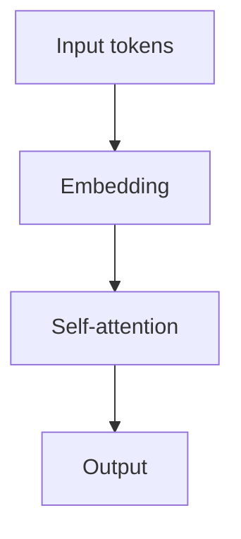

# 10drbob | Deep Learning & NLP Notes

这是一个基于 Docusaurus + TypeScript 的个人 AI 技术作品集，用来整理 Deep Learning、NLP、LLM、RAG 相关笔记，以及正在规划和逐步实现的实践项目。

## 技术栈

- Docusaurus 3
- React + TypeScript
- Markdown / MDX
- KaTeX math rendering
- Prism code highlighting
- Mermaid diagrams
- GitHub Pages
- GitHub Actions

## 本地开发

安装依赖：

```bash
npm install
```

启动本地预览：

```bash
npm run start
```

构建静态网站：

```bash
npm run build
```

执行 TypeScript 检查：

```bash
npm run typecheck
```

构建结果会输出到 `build/` 目录。`build/`、`node_modules/` 和 `.docusaurus/` 不需要提交。

## 技术写作格式

### 数学公式

行内公式使用单个 `$` 包裹：

```md
Self-attention 的缩放因子是 $\sqrt{d_k}$。
```

块级公式使用 `$$` 包裹：

```md
$$
\operatorname{Attention}(Q, K, V) =
\operatorname{softmax}\left(\frac{QK^\top}{\sqrt{d_k}}\right)V
$$
```

### 代码高亮

代码块使用三个反引号，并在开头写语言名。Python 和 PyTorch 示例都建议使用 `python` 高亮：

````md
```python
import torch

x = torch.randn(2, 4)
print(x.shape)
```
````

也可以给代码块加标题：

````md
```python title="attention.py"
def attention(query, key, value):
    return query @ key.transpose(-2, -1)
```
````

### Mermaid 图

Mermaid 图使用 `mermaid` 代码块：

````md

````

可以参考 `docs/examples/technical-writing-demo.md` 查看完整示例页面。

## 当前结构

```text
docs/
├─ examples/
├─ deep-learning/
├─ nlp/
├─ paper-reading/
└─ projects/
```

首页入口在 `src/pages/index.tsx`，项目展示页在 `src/pages/projects.tsx`，项目卡片组件在 `src/components/ProjectCard.tsx`。

## 内容维护原则

1. 课程笔记和论文阅读优先写在 `docs/`。
2. 项目展示先写清楚问题、方法和计划，不要把未完成项目写成已完成。
3. 不写未经复核的实验指标，不伪造在线 Demo。
4. 不上传课程课件原文、内部资料、原始数据、模型权重或 secrets。
5. Blog 用于记录阶段性学习总结和网站维护日志。

## GitHub Pages 部署说明

本项目通过 GitHub Actions 构建 Docusaurus，并使用 GitHub Pages artifact 发布 `build/` 目录。当前站点部署到：

```text
https://10drbob.github.io/
```

当前仓库使用用户主页形式，`docusaurus.config.ts` 中的 `baseUrl` 保持为 `/`。除非部署目标发生变化，否则不要修改 GitHub Pages 或 GitHub Actions 部署配置。

每次 push 到 `main` 后，可以在仓库的 `Actions` 页面查看 `Deploy to GitHub Pages` 工作流运行状态。
