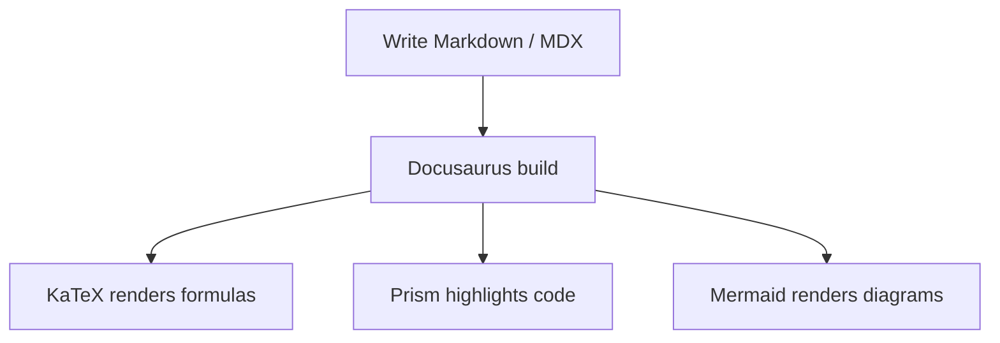
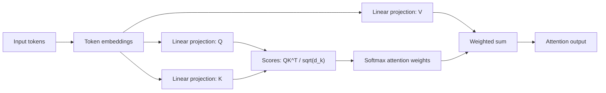

# Technical Writing Demo

这个页面用于验证技术笔记中的 LaTeX 公式、代码高亮和 Mermaid 图表渲染。内容只作为写法示例，不代表新的课程结论或实验结果。

## 1. 行内公式

在句子中可以直接写行内公式，例如 self-attention 中常见的缩放因子是 $\sqrt{d_k}$，其中 $d_k$ 表示 key/query 向量的维度。

## 2. 块级公式

块级公式适合展示核心推导或模型结构：

$$
\operatorname{Attention}(Q, K, V) =
\operatorname{softmax}\left(\frac{QK^\top}{\sqrt{d_k}}\right)V
$$

## 3. Python 代码块

```python
def normalize_scores(scores):
    total = sum(scores)
    if total == 0:
        return [0 for _ in scores]
    return [score / total for score in scores]
```

## 4. PyTorch 代码块

```python title="Scaled dot-product attention"
import math
import torch


def scaled_dot_product_attention(query, key, value):
    dim = query.size(-1)
    scores = query @ key.transpose(-2, -1) / math.sqrt(dim)
    weights = torch.softmax(scores, dim=-1)
    return weights @ value
```

## 5. Mermaid 流程图



## 6. Transformer Attention 流程示例


